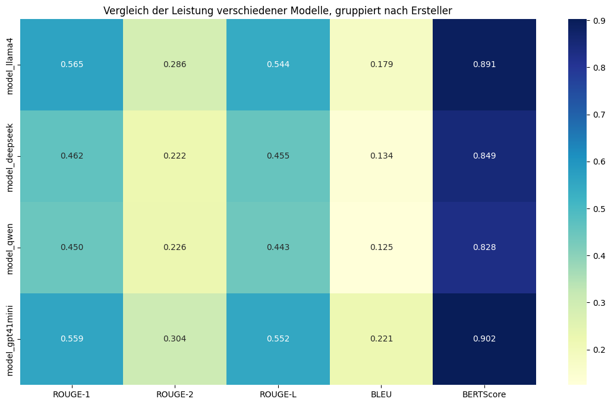

Predictive Retail Intelligence System
Overview
The system leverages Large Language Models (LLMs) to analyze news articles and extract actionable business intelligence for the retail and FMCG (Fast-Moving Consumer Goods) sector. It addresses three critical areas :  competitive intelligence, supply chain risk assessment, and predictive trend analysis.
The system automates the processing of news articles to provide insights on market trends, competitor moves, and supply chain risks, enabling stakeholders to make informed strategic decisions. This project showcases expertise in LLM prompt engineering, data scraping, and retail-specific analysis.

Features

Article Scraping: Collects news articles from retail-focused websites (e.g., retail.ai, retail.dive, grocery.dive) using Newspaper3k.
LLM-Powered Analysis:
Intelligent Classification: Categorizes articles into predefined retail categories (e.g., product innovation, market expansion, supply chain).
Entity Extraction: Identifies brands, products, regions, key figures, and financial data.
Sentiment Analysis: Evaluates market, competitive, and supply chain sentiments.
Trend Detection: Detects emerging trends, product launches, and market disruptions.
Supply Chain Risk Assessment: Analyzes risks related to logistics, suppliers, geopolitics, and economic factors.
Predictive Intelligence: Provides short-term, medium-term, and long-term forecasts with recommendation priorities.
Business Impact Scoring: Rates the criticality of insights on a 1-10 scale for competitive impact, supply chain risk, market opportunity, and strategic importance.

Output Format: Generates a professional newsletter summarizing insights for stakeholders.
Evaluation: Uses "ROUGE-1", "ROUGE-2", "ROUGE-L", "BLEU", "BERTScore" metrics for summary evaluation and manual review for other tasks.

Dataset
The dataset consists of 16 scraped news articles with the following columns:

url: Article URL
title: Article title
publish_date: Publication date
authors: Article authors
scraped_at: Scraping timestamp
keywords: Extracted keywords
text: Full article text
text_length: Length of the article text

Data was collected from retail-focused sources like retail.ai, retail.dive, and grocery.dive.
Methodology

Data Collection:
Scraped articles using Python’s Newspaper3k library.
Cleaned and standardized data (e.g., consistent entity names like "Walmart").

LLM Analysis:
Designed a comprehensive prompt for LLMs to perform classification, entity extraction, sentiment analysis, trend detection, risk assessment, and predictive intelligence.
Tested multiple LLMs (GPT-4o-mini, Llama-Chat, Qwen, DeepSeek), with GPT-4o-mini selected as the reference model based on performance benchmarks from artificialanalysis.ai.

Evaluation:
Applied ROUGE-1-L scores, Bertscore and Bleu to evaluate the quality of generated summaries.

Visualization:
Generated basic visualizations (e.g., category distribution histogram) using Streamlit.

Installation
To run this project locally, follow these steps:
Prerequisites

Python 3.8+
pip
Virtual environment (recommended)

Setup

Clone the repository:git clone https://github.com/lionel-richy/Predictive_Retail_Intelligence_System.git
cd predictive-retail-intelligence

Create and activate a virtual environment:python -m venv venv
source venv/bin/activate  # On Windows: venv\Scripts\activate

Install dependencies:pip install -r requirements.txt

Configure API keys:
Add your LLM API key (e.g., OpenAI for GPT-4o-mini) to a .env file:OPENAI_API_KEY=your_api_key

Dependencies

newspaper3k: For article scraping
openai: For GPT-4o-mini API access
rouge-score, Bleu-score, Meteor and BertScore: For evaluating summaries
pandas: For data manipulation
matplotlib/seaborn/Streamlit: For visualizations
python-dotenv: For environment variables

See requirements.txt for the full list.
Usage

Scrape Articles:Run the scraping script to collect articles:data_collector.ipynb

Output: A Excel file (input/df_init.xlsx) with scraped articles.

Output: A TXT file (outputs/Ergebnis_test/xxx.txt) with analysis results and a formatted newsletter.

Output: quantitative analysis in output/Performance_Metrics/Ref_based_eval_metrics.xlsx and output/Analysis_Results/analysis_results_multi.xlsx
Visualize Insights:Run the visualization script:python scripts/output/Dashboards/main3.py.py

Example Output (gpt4o_mini)

Dear Customer,

Welcome to our weekly newsletter, where we provide you with a brief overview summary of significant events. 

### Article Summaries:

---

### 1. 

**Title**: Is Early Summer Becoming a Bigger Retail Sales Opportunity?  
**Link to source**: https://retailwire.com/discussion/early-summer-retail-sales/  
**Publish_date**: 2025-07-03 13:36:50  
**Summary**: The article discusses the potential for early summer periods to drive increased retail sales, highlighting shifting consumer purchasing patterns and seasonal timing. It suggests that retailers could capitalize on this trend through targeted promotions and inventory planning.  
**Category**: ["consumer_trends", "market_expansion"]  
**Entity Extraction**: null  
**sentiments**:  
- **Market Sentiment**: Positive — indicates an opportunity for growth in retail sales during early summer.  
- **Competitive Sentiment**: Advantage for retailers who adapt quickly.  
- **Supply Chain Sentiment**: Neutral — no specific supply chain issues mentioned.  
**trend detection**:  
- Consumer behavior shift towards early summer shopping  
- Seasonal timing as a market opportunity  
**predictive intelligence**:  
- Short-term Implications (1-3 months): Increased promotional activity and inventory adjustments  
- Medium-term Trends (3-12 months): Potential for sustained seasonal sales shifts  
- Long-term Forecasts (1-3 years): Possible redefinition of seasonal sales cycles  
- Recommendation Priority: Medium — requires tactical adjustments but no immediate crisis  
**Business Impact Scoring**: 6 — Opportunity for revenue uplift with strategic timing, but dependent on execution and consumer response.

---

### 2. 

**Title**: Should Trader Joe’s Open Stores Next To Each Other?  
**Link to source**: https://retailwire.com/discussion/trader-joes-open-stores-adjacent/  
**Publish_date**: 2025-07-01 16:30:00  
**Summary**: The discussion explores the strategic implications of Trader Joe’s potentially opening stores in close proximity, weighing benefits like increased market coverage against cannibalization risks. It emphasizes location strategy and customer convenience as key factors.  
**Category**: ["market_expansion", "competitive_intelligence"]  
**Entity Extraction**: null  
**sentiments**:  
- **Market Sentiment**: Neutral — strategic debate without clear positive or negative bias.  
- **Competitive Sentiment**: Neutral — depends on execution and market context.  
- **Supply Chain Sentiment**: Neutral — no specific issues noted.  
**trend detection**:  
- Store expansion strategies  
- Location clustering and customer convenience  
**predictive intelligence**:  
- Medium-term Trends: Store clustering as a competitive tactic  
- Recommendation Priority: Medium — strategic decision requiring further analysis  
**Business Impact Scoring**: 5 — moderate strategic consideration; impact depends on execution and market response.

---

### 3. 

**Title**: How Can Retailers Best Attract a Growing Cohort of Value-Seeking Consumers, Beyond Price?  
**Link to source**: https://retailwire.com/discussion/how-retailers-attract-value-seeking-consumers/  
**Publish_date**: 2025-07-01 16:00:00  
**Summary**: The article examines strategies for retailers to attract value-conscious consumers beyond just pricing, emphasizing enhanced product quality, loyalty programs, and experiential shopping. It highlights the importance of perceived value and brand trust.  
**Category**: ["consumer_trends", "product_innovation", "retail_tech"]  
**Entity Extraction**: null  
**sentiments**:  
- **Market Sentiment**: Positive — consumers seek value beyond price, creating opportunities.  
- **Competitive Sentiment**: Advantage for brands innovating in value propositions.  
- **Supply Chain Sentiment**: Neutral — no specific issues mentioned.  
**trend detection**:  
- Consumer focus on value and experience  
- Non-price differentiation strategies  
**predictive intelligence**:  
- Medium-term Trends: Shift towards value-based shopping experiences  
- Recommendation Priority: High — strategic for customer retention and growth  
**Business Impact Scoring**: 7 — significant opportunity to differentiate and capture value-seeking segments.

---

### 4. 

**Title**: Customers are ditching Shein and Temu. Can Amazon win them over?  
**Link to source**: https://www.retaildive.com/news/amazon-stands-gain-temu-shein-customers-tariffs-fast-fashion/751950/  
**Publish_date**: 2025-07-01 09:00:00  
**Summary**: The article discusses the decline of Shein and Temu's customer base, with Amazon positioning itself to attract these consumers through competitive pricing, faster delivery, and leveraging tariffs to its advantage. It highlights Amazon’s strategic efforts to capture market share in fast fashion.  
**Category**: ["competitive_intelligence", "market_expansion", "retail_tech"]  
**Entity Extraction**: ["Shein", "Temu", "Amazon"], products: fast fashion, regions: global, dates: 2025-07-01  
**sentiments**:  
- **Market Sentiment**: Positive for Amazon, negative for Shein and Temu  
- **Competitive Sentiment**: Advantage for Amazon in gaining market share  
- **Supply Chain Sentiment**: Opportunity for Amazon to optimize logistics and tariffs  
**trend detection**:  
- Market shift from fast fashion brands to Amazon  
- Competitive positioning and customer acquisition strategies  
**predictive intelligence**:  
- Short-term Implications (1-3 months): Increased customer acquisition efforts by Amazon  
- Medium-term Trends (3-12 months): Potential reshaping of fast fashion market share  
- Long-term Forecasts (1-3 years): Amazon could establish a dominant position in affordable fast fashion  
- Recommendation Priority: High — urgent strategic focus needed  
**Business Impact Scoring**: 8 — high potential to alter competitive landscape and market share dynamics.

---

### 5. 

**Title**: 8 retail trends to watch in 2025  
**Link to source**: https://www.retaildive.com/news/retail-trends-to-watch-2025/735690/  
**Publish_date**: 2025-01-07 14:00:00  
**Summary**: The article outlines eight key retail trends for 2025, including technological innovations, sustainability initiatives, evolving consumer behaviors, and supply chain adaptations, emphasizing the importance of agility and innovation.  
**Category**: ["retail_tech", "sustainability", "consumer_trends", "supply_chain_risk"]  
**Entity Extraction**: null  
**sentiments**:  
- **Market Sentiment**: Positive — highlights growth opportunities through innovation and sustainability  
- **Competitive Sentiment**: Advantage for proactive retailers adopting trends  
- **Supply Chain Sentiment**: Opportunity for resilience and efficiency improvements  
**trend detection**:  
- Technological adoption and innovation  
- Sustainability initiatives  
- Supply chain resilience strategies  
**predictive intelligence**:  
- Long-term Forecasts (1-3 years): Industry transformation driven by technology and sustainability  
- Recommendation Priority: High — critical for strategic planning  
**Business Impact Scoring**: 9 — provides strategic insights into future industry shifts, essential for long-term planning.

---

Stay tuned for our next issue as we delve deeper into the evolving challenges and opportunities shaping the retail landscape.

Warm regards,  
Your retail.ai team

Future Improvements

Real-Time Integration: Develop an API for continuous news feed analysis.
Multilingual Support: Extend analysis to non-English articles for international markets.
Model Fine-Tuning: Fine-tune an open-source LLM to reduce costs.
Advanced Visualizations: Build an interactive dashboard for stakeholders.
deepeval
Ethical Considerations: Implement bias detection in LLM outputs.

Contact
For questions or feedback, reach out via GitHub Issues or email at [panlaprichy@gmail.com].

Appendix

